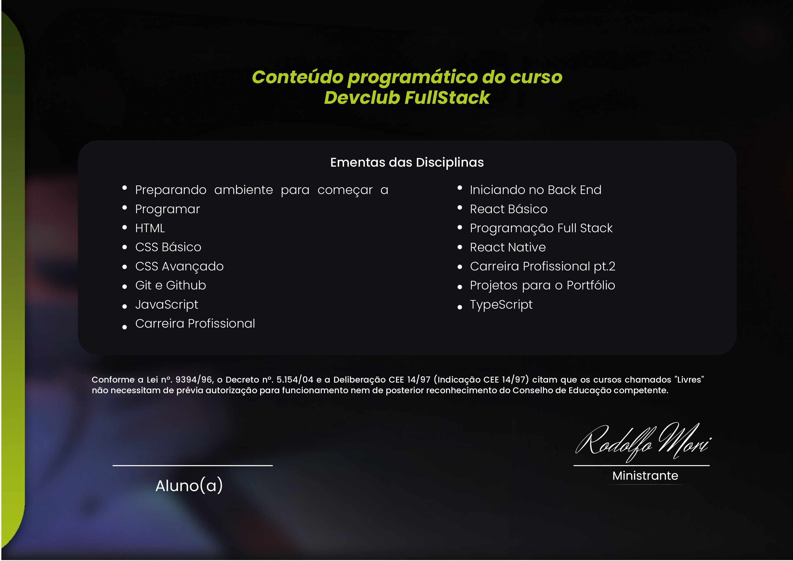

# Quem sou eu?

Olá, sou **Dalio Shindi Yamada**, tenho 39 anos, sou um **Desenvolvedor Full Stack**.

Profissional proativo e organizado com experiência em projetos pessoais na área de desenvolvimento web e mobile, utilizando tecnologias como HTML, CSS, JavaScript, TypeScript, Node.js, React.js, React Native, Next.js, Styled-components, Tailwind CSS, PostgreSQL, MongoDB, Docker, Prisma, Thunder Client e Sequelize. Em busca de oportunidades que me permitam aplicar minhas habilidades e conhecimentos em um ambiente profissional e contribuir para o crescimento da empresa.

> Estou sempre buscando conhecimento para melhorar minhas habilidades técnicas e soft skills

> Meu objetivo é trabalhar como Desenvolvedor Web e conseguir minha primeira oportunidade na área

> Formado em desenvolvedor de sistemas pela <a href="https://www.rodolfomori.com.br">DevClub</a>.

# Profissional com experiência em:

### Front End:

Native

### Back End:

### Ferramentas e plataformas:

# Certificado:

# GitHub Stats:

 

# Entre em contato:

<a href="https://daliosy.github.io/link-tree/">Link Tree</a>

## Visitors Count:

