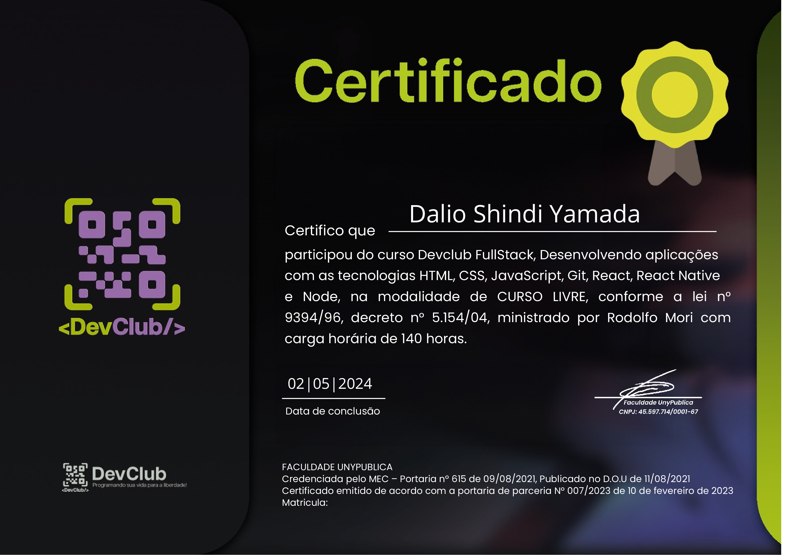
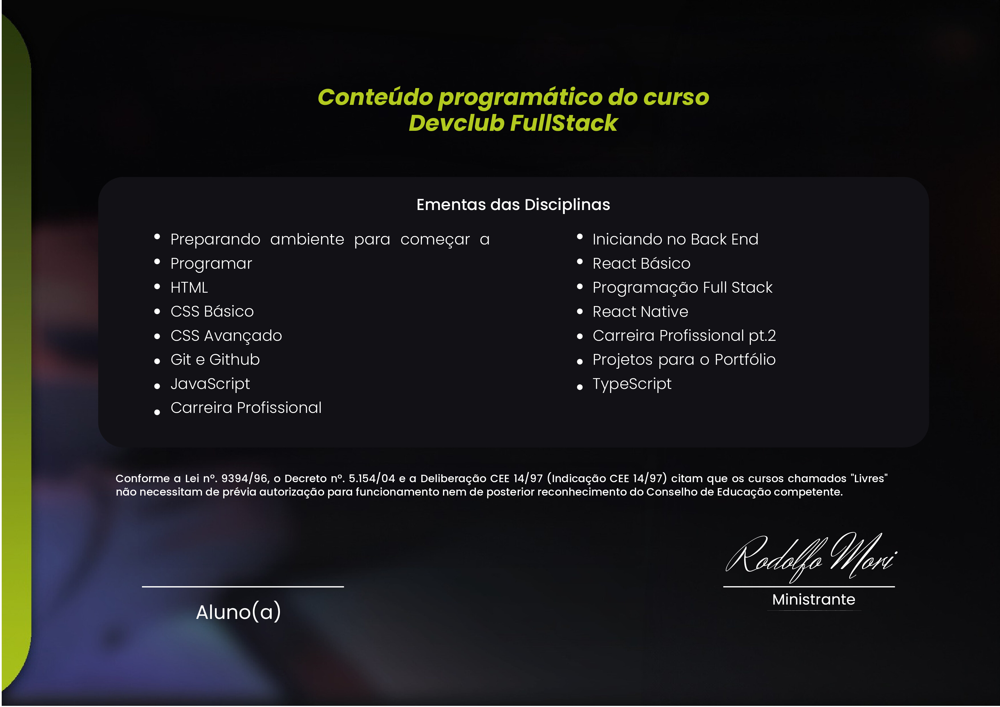

# Sobre mim

Olá, sou **Dalio Shindi Yamada** 👋

Sou um **Desenvolvedor Full Stack** de soluções digitais. Trabalho criando sistemas, sites e aplicativos utilizando tecnologias como **JavaScript, TypeScript, PHP, React.js, Next.js e Node.js**.

Minha entrada no mercado de tecnologia aconteceu em **setembro de 2024**, atuando em projetos da **Guapi Papéis**. 
Me trouxe muita experiência e aprendizado não apenas profissionalmente, mas também como pessoa.

Essa trajetória me ajudou a desenvolver visão de negócio, responsabilidade, comunicação e relacionamento com pessoas. Aprendi muito com todos que passaram pelo meu caminho e continuo evoluindo constantemente através dos estudos e da prática no desenvolvimento de software.

Atualmente participo do desenvolvimento de aplicações web e mobile utilizando tecnologias modernas como **Next.js, React.js, Expo, Laravel, PostgreSQL e Firebase**.

Tenho experiência no desenvolvimento de: 
🚀 Landing pages modernas  
🖥️ Sistemas administrativos  
👥 Cadastro de usuários e produtos  
🔗 Integrações CRUD  
🌐 APIs REST  
📱 Aplicações responsivas  
💻 Plataformas web  
📲 Aplicativos mobile  

 

Essas experiências fortaleceram habilidades como: 
✔️ Resolução de problemas   
✔️ Organização   
✔️ Pensamento lógico   
✔️ Trabalho em equipe   
✔️ Comunicação   
✔️ Persistência   
✔️ Adaptabilidade   
✔️ Proatividade  

 

> 💡 Sempre buscando evoluir como desenvolvedor e como pessoa, criando soluções que realmente façam diferença.
 

# Tecnologias e Ferramentas

### Linguagens de Programação

### Frameworks e Bibliotecas

### Banco de Dados e Cloud

### Ferramentas, DevOps e Plataformas

### Editores de Código

### Inteligência Artificial no Desenvolvimento

 

# Certificados

# GitHub Stats

 

# Conecte-se comigo

> Linkedin: <a href="https://www.linkedin.com/in/dalio-s-yamada/" target="_blank">https://www.linkedin.com/in/dalio-s-yamada </a>

> Portifólio: <a href="https://portfolio-dalio.vercel.app/" target="_blank">https://portfolio-dalio.vercel.app/ </a>

# Visitors Count

